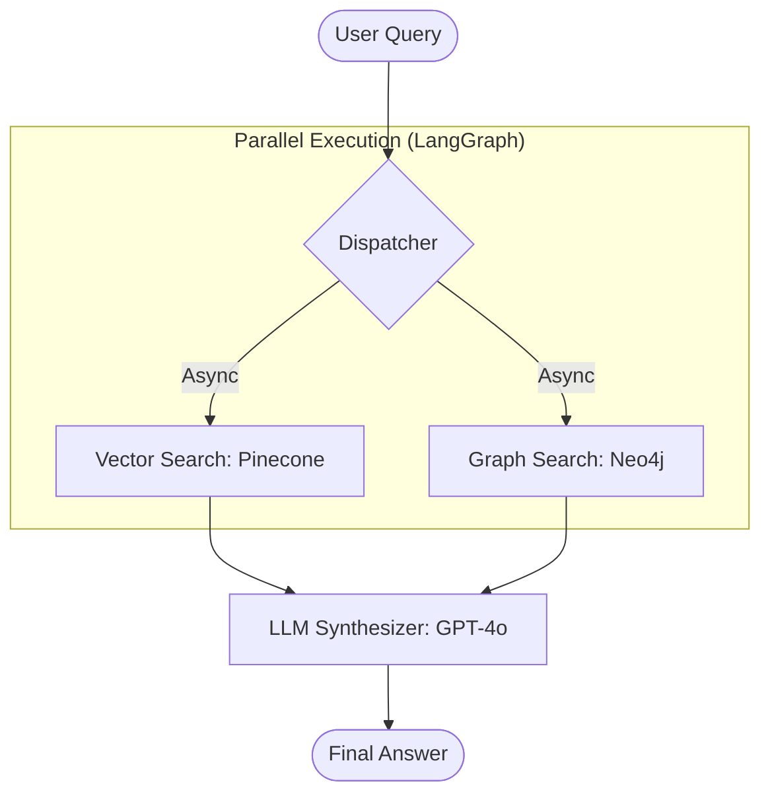

# NEXUSED Study App
NEXUSED is an AI-powered EdTech web application built with FastAPI. It serves as an intelligent study assistant and platform for both students and teachers, featuring an advanced hybrid search/RAG (Retrieval-Augmented Generation) engine, gamification, and predictive analytics.
## Features
- **Teacher & Student Roles**: Instructors can upload course materials (PDFs, DOCX, text) which automatically generate summaries and mock quizzes.
- **Hybrid RAG Engine**: Combines **Vector Search** (Pinecone) and **Knowledge Graph** (Neo4j) queries using LangGraph, synthesized via GPT-4o for comprehensive answers.
- **Automated Knowledge Pipeline**: Uploaded documents are automatically chunked, embedded, and mapped out in a Graph DB.
- **Gamification & Social**: Built-in XP, leveling system, community forum, and Jigsaw study groups.
- **Predictive Analytics**: An ML model (`student_success_model.pkl`) to identify at-risk students based on engagement metrics.
## Getting Started
### Prerequisites
- Python 3.8+
- [Pinecone](https://www.pinecone.io/) Account
- [Neo4j](https://neo4j.com/) Database
- [OpenAI](https://openai.com/) API Key
- PostreSQL / Supabase (Optional for full DB features)
### Installation
1. Clone the repository:
   ```bash
   git clone <your-repo-url>
   cd NEXUSED/Studuy_app
   ```
2. Install dependencies:
   ```bash
   pip install -r requirements.txt
   ```
3. Setup environment variables:
   Copy the example environment file and fill in your actual credentials.
   ```bash
   cp .env.example .env
   ```
4. Run the application:
   ```bash
   uvicorn app:app --reload
   ```
   The application will be available at `http://localhost:8000`.
## Architecture Diagram

## Security Notice
Do not commit your `.env` file to version control. All sensitive keys should be securely managed.
